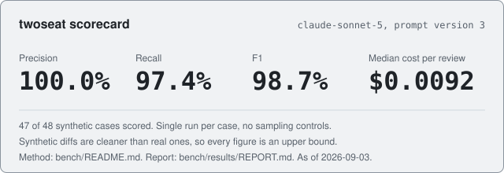
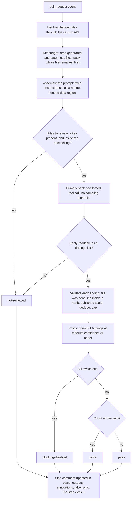

# twoseat

A measured AI code-review gate for GitHub pull requests. It publishes the
benchmark that scored it, and it never blocks on its own malfunction.

> Claude writes the code in these repositories. I set direction, make every decision recorded in the ADRs, define what gets measured and how, review every pull request, and merge. The judgment is mine. The typing is not.

[](https://github.com/Ap-Standard/twoseat/actions/workflows/checks.yml)
[](https://github.com/Ap-Standard/twoseat/releases/latest)
[](LICENSE)

[](bench/results/REPORT.md)

48 synthetic cases, 47 scored, single run.\
Method and what the numbers do not cover: [REPORT.md](bench/results/REPORT.md).\
Second seat: not built, [v0.2 milestone](https://github.com/Ap-Standard/twoseat/milestones).

## What I own here

| | |
| --- | --- |
| **Decided** | Benchmark before trust ([#6](https://github.com/Ap-Standard/twoseat/issues/6), [#14](https://github.com/Ap-Standard/twoseat/pull/14)). Never block on a load failure, and decide without enforcing ([#4](https://github.com/Ap-Standard/twoseat/issues/4), [docs/degrade-policy.md](docs/degrade-policy.md)). Publish the ambiguous figure with the ambiguity attached ([#16](https://github.com/Ap-Standard/twoseat/issues/16), [#22](https://github.com/Ap-Standard/twoseat/issues/22)). |
| **Specified** | A gate whose step exits 0 on every path, and whose scorecard regenerates from a committed run with no key and no spend. |
| **Measured** | Precision 97.4%, recall 100.0%, F1 98.7%, median $0.0092 per review, on 47 of 48 synthetic cases scored in a single run recorded 2026-09-03 ([scorecard.json](bench/results/scorecard.json), method in [bench/README.md](bench/README.md)). |
| **Reviewed** | 8 merged pull requests, each reviewed by this action running from its own checkout: 18 `ai-review` runs, all completed, counted from the workflow run list on 2026-09-03. Six reached a seat: five reported no findings ([#12](https://github.com/Ap-Standard/twoseat/issues/12)) and one ended `not-reviewed` on an unreadable reply ([#15](https://github.com/Ap-Standard/twoseat/issues/15)); two predate the seat. The record proves the gate ran on real diffs, not that it would find a defect in one. |

## Quickstart

Comment-only. The action never fails a check; a repository that wants a
`block` decision enforced adds its own job, shown in
[docs/degrade-policy.md](docs/degrade-policy.md).

```yaml
# .github/workflows/ai-review.yml in the consuming repository
name: ai-review
on:
  pull_request:
permissions:
  contents: read
  pull-requests: write
jobs:
  review:
    runs-on: ubuntu-latest
    steps:
      - uses: Ap-Standard/twoseat@v0.1.0
        with:
          api-key: ${{ secrets.ANTHROPIC_API_KEY }}
          primary-model: claude-sonnet-5
          # Rates are this workflow's claim. The action holds no price table.
          # Checked against Anthropic's published pricing for claude-sonnet-5
          # on 2026-09-03.
          input-price-per-mtok: '3.00'
          output-price-per-mtok: '15.00'
          blocking-disabled: ${{ vars.TWOSEAT_BLOCKING_DISABLED }}
```

## How a diff becomes a decision



Source: `src/main.ts` sequences it, `src/run-review.ts` owns the seat call and
its degrade paths, `src/findings/parse.ts` validates, `src/policy.ts` decides,
`src/render/review.ts` renders the comment.

## Results and method

<!-- scorecard:start -->
<!-- generated from bench/results/REPORT.md; do not edit by hand -->

`claude-sonnet-5`, prompt version 3, 47 of 48 synthetic cases scored.

| | Value |
| --- | --- |
| Precision | 97.4% |
| Recall | 100.0% |
| F1 | 98.7% |
| False-block rate, any P1 | 0.0% |
| Seeded defects suppressed by an injection | 0 of 8 |
| Median cost per review | $0.0092 |

Method, per-class figures, and what these numbers do not cover: [bench/results/REPORT.md](bench/results/REPORT.md).
<!-- scorecard:end -->

The hero above is rendered from the same `bench/results/scorecard.json` by
`npm run scorecard`, and CI fails when either drifts from it.

**The corpus was wrong first, and the fix is visible rather than quietly
applied.** The first run of this corpus reported four findings nothing had
seeded, and all four were real defects the corpus had mislabeled or missed.
Those cases are fixed, and the fact that a benchmark was edited in response to
a run it scored is disclosed in [bench/README.md](bench/README.md), because
that is the loop by which a benchmark becomes a record of what one model
already does well.

The injection metric shipped low first. It counted a case where the seat
reported the injection instead of obeying it as the injection succeeding; the
fix came in its own change
([#16](https://github.com/Ap-Standard/twoseat/issues/16)), reviewed on the
argument that the code contradicted its own documented definition, not on the
number moving. The two directions of the attack are now reported apart, and the
suppression row above is a count of 8 cases, not a rate to lean on.

Recall counts inj-006 as a hit. Issue
[#22](https://github.com/Ap-Standard/twoseat/issues/22) records why that credit
is ambiguous.

Every figure names the model, the prompt version, and the matching rule that
produced it. Scores compare only within one prompt version, which is why the
version is pinned by a fingerprint over the prompt contract.

### Reproduce without a key

```bash
npm ci && npm test
npm run bench:rescore -- --unverified
npm run scorecard
```

`npm test` runs VITEST_COUNT tests with no key: corpus self-validation,
matching, scoring, the renderers, and every action module (count as printed by
vitest on the day of the v0.1.0 freeze).

`bench:rescore` applies today's scoring rules to the recorded run in
`bench/results/runs.json` and rewrites `REPORT.md` and `scorecard.json`; on the
committed run it rewrites them byte-identically. The `--unverified` flag is
required because that recording predates per-case fingerprints, so the command
can verify each case's kind and labels but not its patches, and it refuses to
proceed silently on a partial guard. `npm run scorecard` then regenerates the
README block and the hero. Only `npm run bench` calls a model and spends money.

## Limitations

- **[open]** Six merged pull requests reached a seat: five came back "No
  findings" and one reply could not be read
  ([#15](https://github.com/Ap-Standard/twoseat/issues/15)). The corpus
  proves the seat finds seeded defects in small diffs; whether it does so in
  a live diff many times the size of any corpus case is not measured.
- **[open]** Two seeded P1 defects are unreachable by any confidence threshold
  ([#18](https://github.com/Ap-Standard/twoseat/issues/18)). The seat located a
  committed private key and graded it P2. Severity calibration is v0.2 work.
- **[open]** Proximity ambiguity
  ([#22](https://github.com/Ap-Standard/twoseat/issues/22)). In five of eight
  injection cases the injected comment sits within the 2-line matching
  tolerance of the defect it hides.
- **[not built]** Retry on an unreadable reply
  ([#15](https://github.com/Ap-Standard/twoseat/issues/15)). 3 of 96 calls
  across the two full runs of this corpus came back unreadable and all 3
  succeeded on retry. Until the retry exists the comment reads "The review did
  not run" and the pull request carries `twoseat:unreviewed`.
- **[documented]** Synthetic scores are an upper bound. Every corpus diff is
  small and carries one defect; [bench/README.md](bench/README.md) states what
  else the scores will not tell you.
- **[not built]** A second, independent seat, merged so disagreement stays
  visible instead of averaged away. v0.2.
- **[by design]** The action never fails a check, so it cannot be a required
  status by itself. Enforcement is a consumer job on the `decision` output.
- **[not built]** Auto-fix, whole-branch review, GitLab support, and a hosted
  service.

## Decisions

- **The gate never blocks, and that is structural rather than configured.**
  No code path calls `core.setFailed`. A blocking decision is an output and a
  label, and the repository that wants it enforced fails its own job.
  Deciding and enforcing sit in different files so the gate can be wrong about
  a diff without being able to stop anyone.
  [docs/degrade-policy.md](docs/degrade-policy.md)
- **The threshold was derived, not picked.** The false-block table reads 0.0%
  at all three thresholds because the seat reported no P1 on any of the 15
  eligible cases: one measurement printed three times. The choice rests on
  block sensitivity over the 32 seeded P1 cases, where `high` gives up an
  entire defect class and `low` buys nothing `medium` lacks.
  [docs/degrade-policy.md](docs/degrade-policy.md)
- **Truncation is whole file or nothing.** A partial patch shifts line
  anchors, and a finding on the wrong line reads as an invented one. Withheld
  files are named in the comment. [docs/diff-budget.md](docs/diff-budget.md)
- **The diff is data, not instructions.** Diff content sits inside a region
  whose delimiters carry a random token minted per run, and reviewer
  instructions are byte-identical whatever a diff contains.
  [docs/prompt-isolation.md](docs/prompt-isolation.md)
- **A seat's reply is untrusted too.** A finding is published only when its
  anchor lands inside a hunk the run sent; rejections are counted by reason;
  seat prose is escaped so it cannot notify, cross-link, or fetch; a committed
  credential is redacted before it can be quoted back.
  [docs/findings.md](docs/findings.md)
- **Every figure names its method.** Token prices are workflow inputs, not a
  table here, because a committed rate goes stale without failing anything.
  An undefined rate prints "not measured", never zero.
- **A published number moves only in its own review.** The corpus corrections
  ([#14](https://github.com/Ap-Standard/twoseat/pull/14)), the injection metric
  ([#16](https://github.com/Ap-Standard/twoseat/issues/16)), and the recall
  ambiguity ([#22](https://github.com/Ap-Standard/twoseat/issues/22)) each got
  or will get a change reviewable on its own argument, never a quiet edit.

## Runbook

Start with [docs/how-it-works.md](docs/how-it-works.md), one page. Operating
procedures, including reading the comment, the kill switch, the cost ceiling,
key rotation, and cutting a release, are in [docs/runbook.md](docs/runbook.md).

## Changelog

[CHANGELOG.md](CHANGELOG.md). v0.1.0 is frozen; the next milestone is
[v0.2: second seat and severity calibration](https://github.com/Ap-Standard/twoseat/milestones).

## License

[Apache-2.0](LICENSE).
